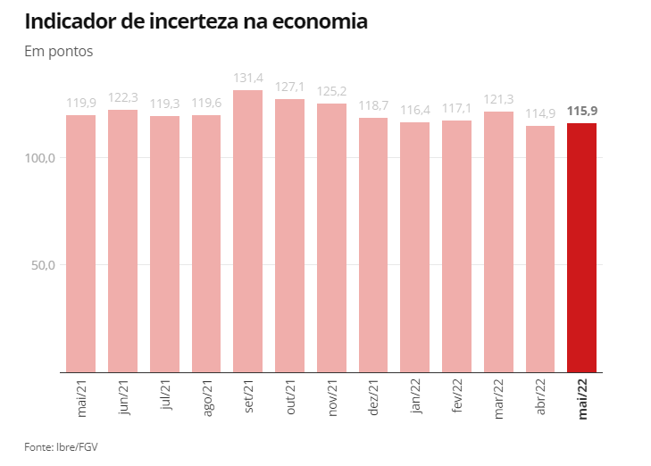

# Exercício 1
```{r}
library('gapminder')
library('ggplot2')

p <- ggplot(data = gapminder, mapping = aes(x = year, y = gdpPercap))
p + geom_line()

p + geom_line(aes(group = country))

p + geom_line(aes(group = country)) + facet_wrap(~continent)

p + geom_line(color="gray70", aes(group = country)) + 
  geom_smooth(size = 1.1, method = "loess", se = FALSE) + 
  scale_y_log10(labels=scales::dollar) + 
  facet_wrap(~ continent, ncol = 5) + 
  labs(x = "Year", 
    y = "GDP per capita", 
    title = "GDP per capita on Five Continents") 
```

```{r}
library('socviz')
p <- ggplot(data = gss_sm, 
  mapping = aes(x = age, y = childs)) 
p + geom_point(alpha = 0.2) + 
  geom_smooth() + 
  facet_grid(sex ~ race) 

p <- ggplot(data = gss_sm, mapping = aes(x = bigregion)) 
p + geom_bar() 
p + geom_bar(mapping = aes(y = ..prop..))
p + geom_bar(mapping = aes(y = ..prop.., group = 1)) 
table(gss_sm$religion) 


p <- ggplot(data = gss_sm, mapping = aes(x = religion, color = religion)) 
p + geom_bar() 
p <- ggplot(data = gss_sm, mapping = aes(x = religion, fill = religion)) 
p + geom_bar() + guides(fill = FALSE) 

p <- ggplot(data = gss_sm, mapping = aes(x = bigregion, fill = religion)) 
p + geom_bar() 
p + geom_bar(position = 'fill') 
p + geom_bar(position = "dodge", mapping = aes(y = ..prop..)) 
p + geom_bar(position = "dodge", mapping = aes(y = ..prop.., group = religion)) 
p + geom_bar(position = "dodge", mapping = aes(y = ..prop.., 
                                               group = bigregion)) + facet_wrap(~bigregion, ncol = 1) 

p <- ggplot(data = midwest, mapping = aes(x = area)) 
p + geom_histogram() 
p + geom_histogram(bins = 10) 
```

```{r}
oh_wi <- c("OH", "WI") 
p <- ggplot(data = subset(midwest, subset = state %in% oh_wi), 
            mapping = aes(x = percollege, fill = state)) 
p + geom_histogram(alpha = 0.4, bins = 20) 

p <- ggplot(data = midwest, mapping = aes(x = area)) 
p + geom_density() 

p <- ggplot(data = midwest, mapping = aes(x = area, fill = state, 
                                          color = state)) 
p + geom_density(alpha = 0.3) 

p <- ggplot(data = subset(midwest, subset = state %in% oh_wi), 
            mapping = aes(x = area, fill = state, color = state)) 
p + geom_density(alpha = 0.3, mapping = (aes(y = ..scaled..))) 
```

```{r}
p <- ggplot(data = titanic, mapping = aes(x = fate, y = percent, fill = sex))
p + geom_bar(position = "dodge", stat = "identity") + theme(legend.position = "top") 

oecd_sum

p <- ggplot(data = oecd_sum, mapping = aes(x = year, y = diff, fill = hi_lo)) 
p + geom_col() + guides(fill = 'none') + labs(x = NULL, y = "Difference in Years", title = "The US Life Expectancy Gap", subtitle = "Difference between US and OECD average life expectancies, 1960-2015", caption = "Data: OECD. After a chart by Christopher Ingraham, Washington Post, December 27th 2017.")
```

# Exercício 2
```{r}
iris

```

# Exercício 3
```{r}

```

# Exercício 4

O gráfico escolhido está disponível em <https://g1.globo.com/economia/noticia/2022/05/31/inflacao-e-protagonista-em-aumento-de-incerteza-com-economia-brasileira-diz-fgv-ibre.ghtml> (acesso em 31/05/2022).



```{r}
library('tidyverse')

meses <- c('mai/21', 'jun/21', 'jul/21', 'ago/21', 'set/21', 'out/21', 'nov/21', 'dez/21', 'jan/22', 'fev/22', 'mar/22', 'abr/22', 'mai/22')

incerteza <- c(119.9, 122.3, 119.3, 119.6, 131.4, 127.1, 125.2, 118.7, 116.4, 117.1, 121.3, 114.9, 115.9)

df <- data.frame(meses, incerteza)
dadinhos <- as_tibble(df)

dadinhos

grafinho <- ggplot(dadinhos, aes(x = meses, y = incerteza)) + geom_bar(stat = 'identity', width = 0.65, fill = 'pink') + labs(x = NULL, y = NULL, title = 'Indicador de incerteza na economia', subtitle = 'Em pontos') + geom_text(label = dadinhos$incerteza, nudge_y = 5) + theme(axis.text.x = element_text(angle = 90, vjust = 0.5, hjust=1)) + scale_y_continuous(labels = scales::number_format(accuracy = 0.1))
grafinho
```